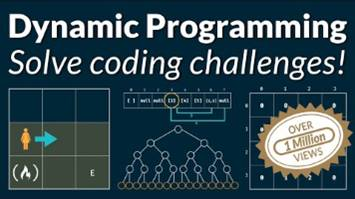

# ts-experiments - Quick TypeScript Experiments

A place for quick experiments in TypeScript with node and Vitest.

From [Dynamic Programming - Learn to Solve Algorithmic Problems & Coding Challenges](https://youtu.be/oBt53YbR9Kk)

1. ([00:00:00](https://www.youtube.com/watch?v=oBt53YbR9Kk&t=0s)) course introduction
1. ([00:03:30](https://www.youtube.com/watch?v=oBt53YbR9Kk&t=210s)) fib memoization
1. ([00:38:39](https://www.youtube.com/watch?v=oBt53YbR9Kk&t=2319s)) gridTraveler memoization
1. ([01:04:52](https://www.youtube.com/watch?v=oBt53YbR9Kk&t=3892s)) memoization recipe
1. ([01:09:56](https://www.youtube.com/watch?v=oBt53YbR9Kk&t=4196s)) canSum memoization
1. ([01:29:29](https://www.youtube.com/watch?v=oBt53YbR9Kk&t=5369s)) howSum memoization
1. ([01:52:06](https://www.youtube.com/watch?v=oBt53YbR9Kk&t=6726s)) bestSum memoization
1. ([02:12:45](https://www.youtube.com/watch?v=oBt53YbR9Kk&t=7965s)) canConstruct memoization
1. ([02:38:36](https://www.youtube.com/watch?v=oBt53YbR9Kk&t=9516s)) countConstruct memoization
1. ([02:47:30](https://www.youtube.com/watch?v=oBt53YbR9Kk&t=10050s)) allConstruct memoization
1. ([03:10:53](https://www.youtube.com/watch?v=oBt53YbR9Kk&t=11453s)) fib tabulation
1. ([03:22:17](https://www.youtube.com/watch?v=oBt53YbR9Kk&t=12137s)) gridTraveler tabulation
1. ([03:34:32](https://www.youtube.com/watch?v=oBt53YbR9Kk&t=12872s)) tabulation recipe
1. ([03:37:59](https://www.youtube.com/watch?v=oBt53YbR9Kk&t=13079s)) canSum tabulation
1. ([03:53:01](https://www.youtube.com/watch?v=oBt53YbR9Kk&t=13981s)) howSum tabulation
1. ([04:07:21](https://www.youtube.com/watch?v=oBt53YbR9Kk&t=14841s)) bestSum tabulation
1. ([04:20:50](https://www.youtube.com/watch?v=oBt53YbR9Kk&t=15650s)) canConstruct tabulation
1. ([04:38:06](https://www.youtube.com/watch?v=oBt53YbR9Kk&t=16686s)) countConstruct tabulation
1. ([04:50:23](https://www.youtube.com/watch?v=oBt53YbR9Kk&t=17423s)) allConstruct tabulation
1. ([05:07:44](https://www.youtube.com/watch?v=oBt53YbR9Kk&t=18464s)) closing thoughts

## See also

1. [TypeScript Bad Habits](https://link.medium.com/2DBxUVVedtb)

## TODO

- [ ] Checkout the following
  - [ ] Suffix Trees
  - [ ] Heaps
    - Min Heap
    - Max Heap
  - [ ] Heap Sort
  - [ ] Quick Select

Copyright &copy; 2022 Jonathan Kimball
